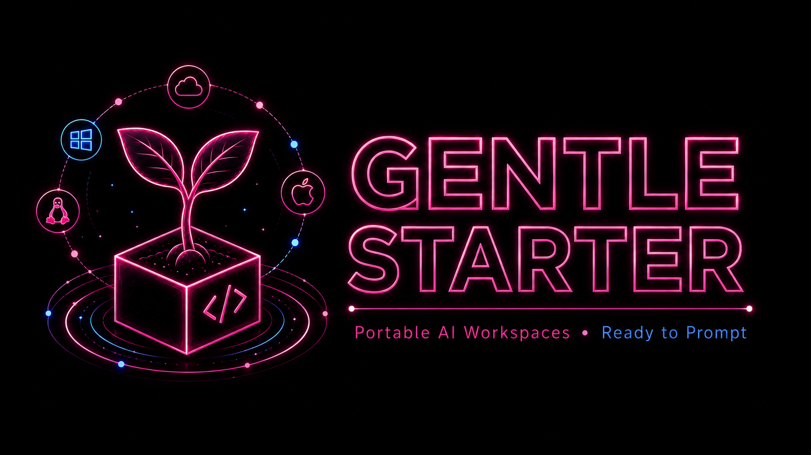

<div align="center">



<h1>🌱 Gentle Starter</h1>

<p><strong>Isolated and portable "ready-to-prompt" environment for the Gentle AI ecosystem</strong></p>

<p>
<a href="LICENSE"></a>

</p>

<p><strong>Documentation:</strong> <a href="./docs/en/README.md">English</a></p>

</div>

---

## 🎯 What does it do?

It provides a preconfigured, cross-platform, reliable, extensible, and
replicable "ready-to-prompt" environment for starting AI projects in an orderly
way: understand the goal, clarify requirements, use SDD/OpenSpec artifacts,
apply skills, coordinate subagents, implement in phases —discover, research,
design, plan, implement, and verify— and iterate until the expected results are
achieved.

The project is designed to provide a clean base structure before launching any
prompt, enabling workflows like these:

```shell
1. git clone repo  --> rename project-foo --> prompt "create ..."
2. git clone repo  --> rename project-bar --> prompt "design ..."
3. copy/paste repo --> rename project-baz --> prompt "research ..."
```

## 📦 What's included?

- **[OpenCode](https://opencode.ai/docs/)** as the default assisted-development
  interface.
- **[Pi Coding Agent](https://github.com/earendil-works/pi#quick-start)** as an
  alternative extensible harness.
- **[Gentle AI](https://github.com/Gentleman-Programming/gentle-pi#install)** for
  controlled Pi workflows alongside OpenCode.
- **[Engram](https://github.com/Gentleman-Programming/engram#quick-start)** as local persistent memory inside the environment.
- **[Context7](https://github.com/upstash/context7)** integrated through MCP for current library documentation.
- **[Dev Container](https://code.visualstudio.com/docs/devcontainers/containers#_installation)** based on [Ubuntu 24.04](https://releases.ubuntu.com/noble/).
- **[Docker Compose](https://docs.docker.com/compose/install/)** to build and run the environment.
- **[Taskfile](https://taskfile.dev/installation/)** to centralize common commands.
- **Versioned skills**, a base set that you can update and customize.
- **[Playwright](https://playwright.dev/docs/intro#installing-playwright)** for optional e2e tests.
- **[Go](https://go.dev/doc/install)** and
  **[Java 25](https://sdkman.io/jdks#tem)** installers in the opt-in catalog;
  Java uses [SDKMAN](https://sdkman.io/install) and Temurin by default.
- **[pnpm](https://pnpm.io/installation)**, installed globally from the latest stable npm release.
- Separate scripts to install and configure Ubuntu dependencies.

## ✅ Requirements

On your PC you need:

- **[Git](https://git-scm.com/downloads)**
- **[Task](https://taskfile.dev/installation/)**
- **[Docker](https://docs.docker.com/get-started/get-docker/)**
- **[Dev Container CLI](https://github.com/devcontainers/cli#installation)**

[jq](https://jqlang.org/download/) is useful for optional diagnostics but is not
required for the happy path.

> Alternatively, use an IDE with Dev Container support, such as
> [VS Code](https://code.visualstudio.com/download),
> [Cursor](https://cursor.com/downloads), or
> [IntelliJ](https://www.jetbrains.com/idea/download/).

## 🚀 Quick start

### Fast path: start a new project from this base

1. On your PC:

    ```bash
    git clone https://github.com/Cesarucho/gentle-starter.git <my-project-name>
    cd <my-project-name>
    cp .env.example .env
    task project:init         # optional: remove identity and start new Git history
    task validate             # optional host-safe check
    ```

    > `task project:init` requires a clean worktree. It asks for a new,
    > non-existing branch and an optional origin URL, shows the complete cleanup
    > plan, and requires `CREATE ROOT` before changing anything. It then applies
    > the same identity cleanup as `task clean`, creates one parentless root
    > commit, and removes previous local branches, tags, and other refs. Unreachable
    > objects remain until Git garbage collection. A blank origin preserves the
    > current one; no remote is contacted or pushed. Use `task clean` instead when
    > you want to remove only the starter identity while keeping the existing Git
    > history.

    Both `task clean` and `task project:init` preserve `LICENSE` unchanged as the
    inherited Gentle Starter MIT attribution. This is the safe default and does
    not add another interactive choice.

### Build and enter the environment

1. In your **terminal**, run:

    ```bash
    task container:up         # it will build the image if needed
    task container:connect
    ```

    > If you use an **IDE**, look for the `Dev Containers: Reopen in Container` option (or similar).

2. Inside the container, you can use any tool normally. If you are using an **IDE**, look for the option to open its terminal.

    ```bash
    git status
    engram tui
    opencode --version

    # Alternative Gentle AI interface
    pi --version

    # Optional checks and maintenance
    task validate:full
    task deps:update

    # Install temporary packages for experiments
    sudo apt update
    sudo apt install {foo}
    ```

    > Note: installing tools on the fly is useful for experiments, but once
    > validated they should be added to `.devcontainer/install/...` as part of
    > the base environment.

3. Connect your AI provider and start OpenCode:

    ```bash
    opencode auth login       # choose and authenticate a provider
    opencode                  # open the default interface
    ```

    Example prompts:

    ```text
    Read AGENTS.md as a template and help me fill in the placeholders.

    Explain how this environment works and help me start a new project.

    Based on the `.devcontainer/` structure, add PostgreSQL 16 with a
    version-controlled `pg_hba.conf` and persistent data volume.
    ```

    Pi remains available for Gentle AI workflows:

    ```bash
    pi                        # open Pi
    # Inside Pi, use /login to choose a provider
    ```

## 🛠️ Useful commands

### Diagnostics and validation

```bash
# Basic diagnostics
task doctor

# Host-safe repository validation (does not force specific skills)
task validate

# Strict validation, recommended inside the container
task validate:full
```

### Install catalog management

```bash
# Show install scripts and the full dynamic catalog from .devcontainer/install/available/
task install:list

# Legacy alias kept for compatibility; same output as install:list
task install:list -- --presets

# Enable a new tool from .devcontainer/install/available/
task install:enable -- 40-php-lang

# Disable a tool for future builds and postCreate runs
task install:disable -- 40-php-lang

# Verify install layout and symlink integrity
task install:doctor
```

### Dependency policy

```bash
# Update approved pins atomically and report deliberate exclusions
task deps:update

# Apply the updated policy to the environment later
task container:rebuild
```

`deps:update` updates the repository policy only. It also prints every
deliberately excluded policy with its reason. For Gentle AI, it checks the latest
stable release and reports when a newer version is available, but it never changes
the version or either architecture digest. Manual approval keeps those three trust
inputs pinned and reviewed together for installer integrity. Failure of this
advisory check is warning-only and cannot block or partially publish an otherwise
validated managed update. The command never rebuilds the container or changes the
live environment. See
[ADR 0002](docs/en/adr/0002-centralized-tool-version-policy.md).

Inspect OpenCode MCP servers, including Context7:

```bash
opencode mcp list
```

Inside Pi, use `/mcp` instead.

### Language toolchain

```bash
# Available by default
pnpm --version

# Available after enabling their catalog installers
go version
java --version
```

### Container lifecycle

```bash
# Container commands, only useful on your PC (outside the container)
task container:build
task container:up
task container:restart      # remove and start the existing image
task container:rebuild      # remove, build, and start
```

### Container entrypoints

```bash
# These tasks auto-start the devcontainer if it is not running
task container:connect      # open a shell; run `opencode` inside
task container:opencode     # continue OpenCode using `opencode -c`
task container:pi           # connect to Pi using `pi --continue`
task container:engram       # connect to the Engram TUI
```

### Skills and quality

```bash
# Flexible project skills
task skill:sync

# Validate external lock entries and project-authored local skills
task skill:validate

# New-project initialization and identity cleanup (LICENSE is preserved)
task project:init           # clean identity and create a parentless root commit
task clean                  # clean identity but preserve Git history
task clean:identity         # explicit alias for task clean

# Script and Markdown quality checks
task quality:check
task quality:full
```

## 🗂️ Repository structure

```text
.
├── .agents/                        Versioned project skills
│   └── local-skills.txt            Project-authored skills preserved by prune
├── .atl/                           <-- not versioned -->
├── CHANGELOG.md
├── .devcontainer
│   ├── devcontainer.json           Dev Container configuration
│   ├── devcontainer-lock.json
│   ├── docker-compose.yml          Dev Container service
│   ├── Dockerfile                  Base image for the development environment
│   ├── install/                    Install layout and catalog
│   │   ├── 01-core/                Mandatory build scripts
│   │   ├── 02-enabled/             Ordered aliases to active installers
│   │   ├── 03-hooks/               User extensions, visible to Git
│   │   ├── available/              Install catalog
│   │   ├── lib/                    Shared helpers
│   │   └── templates/              Installer template
│   ├── opencode-config/            Base OpenCode configuration
│   ├── pi-config/                  Base Pi, MCP, and Gentle AI configuration
│   └── setup.sh                    Container post-create script
├── docs
│   ├── assets/
│   ├── en/README.md                Full English documentation
│   └── en/security.md              English security guide
├── .env                            <-- not versioned -->
├── .env.d/                         Persistent local state, <-- not versioned -->
├── .env.example                    Example local variables for `.env`
├── .gitignore
├── LICENSE
|
├── openspec/                       Optional project source of truth
|
├── .pi/                            <-- not versioned -->
├── README.md                       Main documentation (English)
├── skills-lock.json                External skills lock file
├── .taskfiles
│   ├── devcontainer.yml            Dev Container tasks
│   ├── doctor.yml                  Diagnostic tasks
│   ├── install.yml                 Install-layout tasks
│   ├── project.yml                 History-free project initialization task
│   ├── scripts                     Task helper scripts
│   ├── skills.yml                  Skill-management tasks
│   └── ssh.yml
└── Taskfile.yml                    Main task entry point
```

## 💾 Local state and persistence

The `.env.example` file documents safe local variables for creating your own
`.env`:

```bash
cp .env.example .env
```

The `.env.d/` directory is intended to store local environment state and should not
be versioned. It is currently used to mount data such as:

```text
.env.d/                       Content <-- not versioned -->
├── .engram                   Local Engram database
│   ├── engram.db
│   ├── engram.db-shm
│   └── engram.db-wal
├── .gitconfig                Local Git configuration inside the container
│   ├── config
│   └── .git-credentials
├── .opencode
│   └── share/                Local OpenCode application state
└── .pi                       Local Pi state and configuration
    ├── agent/
    └── gentle-ai/
```

> Important: do not commit tokens, credentials, or local databases to Git. The
> repository ignores `.env.d/`, `.env`, `.pi/`, and `.atl/` to avoid publishing
> local state by accident.

## ⚙️ Basic customization

### 📥 Install system packages

Edit `.devcontainer/install/01-core/10-system.sh` to add packages installed with
`apt` during the image build.

### 🌎 Update timezone and locales

Edit the Dockerfile arguments in `.devcontainer/Dockerfile`, for example:

```dockerfile
ARG LOCALE=es_MX.UTF-8
ARG TZ=America/Mexico_City
```

### 🧩 Add installation scripts

The install layout is organized into three runtime groups (with a
visual-order prefix), the opt-in catalog, and shared infrastructure:

```text
.devcontainer/install/
├── 01-core/               Mandatory scripts (00-pre-apt, 10-system, 15-task,
│                          90-post-setup-users, 99-cleanup)
├── 02-enabled/            Symlinks to active available/ scripts
├── 03-hooks/              User extensions, intentionally visible to Git
├── available/             Install catalog (numbered 00-99)
├── lib/                   Shared helpers (common.sh)
└── templates/             install-script.sh template for new scripts
```

The Docker build runs scripts in the order `01-core` → `02-enabled` →
`03-hooks` (the `for group in` loop in the Dockerfile). Within each
group, scripts are sorted by filename, so the numeric prefix inside
the filename (e.g. `20-runtime-…`, `30-ai-…`) controls the in-group
order. Scripts in `available/` are dormant until you link them into
`02-enabled/`.

To add a new opt-in tool:

```bash
# 1. Copy the template
cp .devcontainer/install/templates/install-script.sh \
   .devcontainer/install/available/40-cli-mycli.sh

# 2. Fill in the variables, idempotency check, install, and verify
#    sections. Source lib/common.sh for shared helpers (logging, arch
#    detection, devcontainer_run_as_root, devcontainer_has_cmd, etc.).

# 3. Validate locally
shellcheck .devcontainer/install/available/40-cli-mycli.sh
bash -n .devcontainer/install/available/40-cli-mycli.sh

# 4. Enable it (creates an ordered alias in 02-enabled/)
task install:enable -- 40-cli-mycli

# 5. Rebuild and verify
task container:rebuild
```

Manage the install layout with these tasks:

```bash
task install:list                # Show install scripts and full catalog status
task install:list -- --presets   # Legacy alias; same output as install:list
task install:enable -- NAME      # Enable through an ordered 02-enabled/ alias
task install:disable -- NAME     # Remove every valid alias for that installer
task install:doctor              # Verify install/ layout integrity
```

Ordered alias names may differ from their `available/` script names. Disabling a
script changes future builds and postCreate repairs; it does not uninstall state
already persisted under `.env.d/`.

A few rules for new scripts:

- Drop `-u` (nounset) only inside the subshell that sources SDKMAN.
  `lib/common.sh` runs under `set -euo pipefail`, but the Java carve-out
  uses `set -eo pipefail` inside the sudo heredoc to avoid
  `SDKMAN_CANDIDATES_API: unbound variable`.
- Use `devcontainer_run_as_root` instead of raw `sudo` so the script works
  in both build (root) and runtime (non-root) contexts.
- Use `devcontainer_has_cmd` for idempotency at the top of the script so
  re-runs are no-ops.
- Source files in `.devcontainer/install/` are mode 0755 to match the
  bind-mount and Dockerfile `chmod 0755` contract; the doctor task
  detects broken symlinks and missing helpers.

### 🔌 Configure optional MCP servers

OpenCode MCP configuration is seeded from `.devcontainer/opencode-config/`.
Inspect active servers with:

```bash
opencode mcp list
```

Active Pi MCP configuration lives in:

```text
.devcontainer/pi-config/agent/mcp.json
```

Optional presets are versioned in:

```text
.devcontainer/pi-config/agent/mcp.presets.json
```

To enable a preset, copy its server entry into `mcp.json > mcpServers`, then
reload Pi with `/reload`. The GitHub preset requires
`GITHUB_PERSONAL_ACCESS_TOKEN` in `.env`; use a fine-grained token with the
minimum permissions required for your workflow.

### 🧠 Manage skills

Project skills live in `.agents/skills/`. External skills restored by the Skills
CLI are controlled from `skills-lock.json`; repository-authored skills are listed
one per line in `.agents/local-skills.txt`. `skill:prune` preserves the union and
`skill:validate` checks both sources without inventing external lock metadata.

Useful commands:

```bash
task skill:add -- <package> --skill <skill-name>
task skill:install
task skill:update
task skill:validate
task skill:sync
```

After modifying skills, review and version the relevant changes:

```bash
git diff -- skills-lock.json .agents/local-skills.txt .agents/skills
```

## 🔐 Security

This starter uses Docker-in-Docker and elevated permissions for some development
flows. Do not publish `.env`, `.env.d/`, `.pi/`, or `.atl/`.

See [security.md](docs/en/security.md).

## 📝 Changelog

See [CHANGELOG.md](CHANGELOG.md).

## 📄 License

MIT. See [LICENSE](LICENSE).
