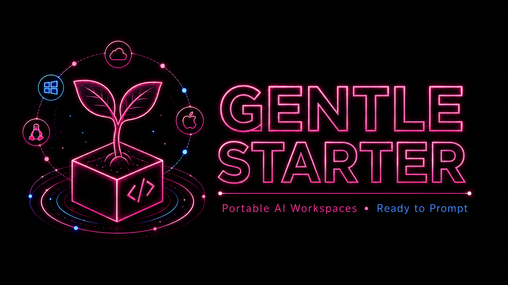

<div align="center">



<h1>🌱 Gentle Starter</h1>

<p><strong>Isolated and portable "ready-to-prompt" environment for the Gentle AI ecosystem</strong></p>

<p>
<a href="LICENSE"></a>

</p>

<p><strong>Documentation:</strong> <a href="./docs/en/README.md">English</a></p>

</div>

---

## 🎯 What does it do?

It provides a preconfigured, cross-platform, extensible, and replicable
"ready-to-prompt" environment for starting AI projects in an orderly
way: understand the goal, clarify requirements, use SDD/OpenSpec/ODD artifacts,
apply skills, coordinate subagents, implement in phases — discover > research >
design > plan > implement > verify — and iterate until the expected results are
achieved.

The project on this branch is the **producer** designed to provide a clean baseline
structure before starting a new project or integrating it with an existing project.
As a **consumer**, you should clone the `starter` branch and create the remote `upstream`
for future upgrades. These are core files:

```bash
.
├── .agents
│   └── skills
│       └── add-tool/
├── .devcontainer/
├── .taskfiles/
├── .env.d/
├── .markdownlint-cli2.yaml
└── Taskfile.yml
```

> The complete structure is [mentioned here](#️-repository-structure-for-consumers)

## 📦 What's included?

The environment combines mandatory core tools with opt-in catalog tools and
integrations—not everything below is installed by default.

- **[OpenCode](https://opencode.ai/docs/)** as the default assisted-development
  interface.
- **[Pi Coding Agent](https://github.com/earendil-works/pi#quick-start)** as an
  opt-in alternative extensible harness (disabled by default).
- **[Gentle AI](https://github.com/Gentleman-Programming/gentle-ai)** for
  managed AI workflows alongside OpenCode, included in the mandatory core.
- **[Engram](https://github.com/Gentleman-Programming/engram#quick-start)** as local persistent memory inside the environment.
- **[Dev Container](https://code.visualstudio.com/docs/devcontainers/containers#_installation)** based on [Ubuntu 24.04](https://releases.ubuntu.com/noble/).
- **[Taskfile](https://taskfile.dev/installation/)** to centralize common commands.

You can activate catalog tools or add your own installers, with or without AI. See
[the install layout](.devcontainer/docs/install-tree.md) and [cache boundaries](docs/en/container-foundation.md).
Run `task install:list` for the current catalog and activation state.

<details>
<summary>Supporting tools and optional extensions list: 👇🏼</summary>

### Environment and packages

| Tool | Purpose |
| --- | --- |
| [Node.js](https://nodejs.org/) | Run JavaScript programs and command-line development tools |
| [npm](https://www.npmjs.com/) | Install, publish, and manage JavaScript package dependencies |
| [pnpm](https://pnpm.io/) | Install and manage packages with a fast, workspace-aware workflow |
| [Go](https://go.dev/) | Compile and run Go applications and developer tools |
| [Java 25](https://sdkman.io/jdks#tem) | Run and build JVM applications with the optional toolchain |
| [SDKMAN](https://sdkman.io/) | Install and switch between Java SDK versions per environment |
| [Temurin](https://adoptium.net/temurin/) | Provide the default OpenJDK distribution for Java development |
| [PHP](https://www.php.net/) | Run PHP applications and command-line scripts |
| [Composer](https://getcomposer.org/) | Install and manage PHP application dependencies |

### Testing and debugging

| Tool | Purpose |
| --- | --- |
| [Bats](https://github.com/bats-core/bats-core) | Exercise shell scripts with readable Bash test cases |
| [PHPUnit](https://phpunit.de/) | Run unit and integration tests for PHP code |
| [Xdebug](https://xdebug.org/) | Inspect PHP execution with breakpoints and runtime diagnostics |
| [Vitest](https://vitest.dev/) | Run fast JavaScript and TypeScript unit tests |
| [Delve](https://github.com/go-delve/delve) | Debug Go programs with breakpoints and stack inspection |
| [Playwright](https://playwright.dev/) | Automate browser scenarios for end-to-end testing |
| [Chromium](https://www.chromium.org/) | Provide a browser runtime for automated test sessions |
| [@playwright/cli](https://www.npmjs.com/package/@playwright/cli) | Control browser sessions from agent workflows |

### Documentation, APIs and diagrams

| Tool | Purpose |
| --- | --- |
| [Context7](https://github.com/upstash/context7) | Retrieve current library documentation through MCP requests |
| [markdownlint-cli2](https://github.com/DavidAnson/markdownlint-cli2) | Check Markdown style and formatting in documentation |
| [Glow](https://github.com/charmbracelet/glow) | Read and preview Markdown directly in a terminal |
| [Spectral CLI](https://www.npmjs.com/package/@stoplight/spectral-cli) | Lint API descriptions against reusable quality rules |
| [Redocly CLI](https://www.npmjs.com/package/@redocly/cli) | Validate, bundle, and preview OpenAPI descriptions |
| [AsyncAPI CLI](https://www.npmjs.com/package/@asyncapi/cli) | Validate and work with event-driven API descriptions |
| [Mermaid CLI](https://www.npmjs.com/package/@mermaid-js/mermaid-cli) | Render text-defined diagrams for documentation and reviews |
| [Archify](https://github.com/tt-a1i/archify) | Explore interactive diagrams for software architecture |
| [Graphviz](https://graphviz.org/) | Generate graphs from structured relationships and data |
| [PlantUML](https://plantuml.com/) | Create diagrams from concise text-based definitions |
| [C4-PlantUML](https://github.com/plantuml-stdlib/C4-PlantUML) | Model software architecture with C4 diagram conventions |
| [Graphify](https://pypi.org/project/graphifyy/) | Build and inspect knowledge graphs from connected concepts |
| [Graphify MCP](https://pypi.org/project/graphifyy/) | Expose graph operations to MCP-compatible clients |

### Infrastructure and security

| Tool | Purpose |
| --- | --- |
| [Docker Compose](https://docs.docker.com/compose/) | Build and run isolated application containers |
| [OpenSSH](https://www.openssh.com/) | Connect to hosts and provide secure remote shell access |
| [Ansible Core](https://docs.ansible.com/ansible-core/) | Automate repeatable configuration and deployment tasks |
| [kubectl](https://kubernetes.io/docs/reference/kubectl/) | Inspect and manage resources in Kubernetes clusters |
| [Terraform](https://developer.hashicorp.com/terraform) | Define and provision infrastructure from declarative configuration |
| [OpenTofu](https://opentofu.org/) | Provision infrastructure with an open-source declarative workflow |
| [Terragrunt](https://github.com/gruntwork-io/terragrunt) | Coordinate reusable infrastructure configurations and deployments |
| [Pulumi](https://github.com/pulumi/pulumi) | Provision cloud resources using general-purpose languages |
| [Gitleaks](https://github.com/gitleaks/gitleaks) | Scan repositories for accidentally committed secrets |

### Skills and agent extensions

| Tool | Purpose |
| --- | --- |
| [Skills CLI](https://github.com/vercel-labs/skills) | Install and update reusable agent skills |
| [Gentleman Guardian Angel (GGA)](https://github.com/Gentleman-Programming/gentleman-guardian-angel) | Provide image-installed review tooling; project setup and Git hooks are optional manual steps |

Base Pi remains optional. Repository-managed Pi extension provisioning has been
retired without uninstalling existing user packages or deleting persisted state.

### Audio

| Tool | Purpose |
| --- | --- |
| [PulseAudio](https://www.freedesktop.org/wiki/Software/PulseAudio/) | Provide optional audio playback clients such as `paplay` |

Versioned skills provide a customizable base: external packages are tracked in
`skills-lock.json`; repository-authored skills live in `.agents/skills/` and are
tracked by Git. Host audio integration is separate from audio clients.

</details>

## ✅ Requirements

On your PC host, install current stable releases:

- **[Git](https://git-scm.com/downloads)**
- **[Task](https://taskfile.dev/installation/)**
- **[Docker](https://docs.docker.com/get-started/get-docker/)**
- **[Dev Container CLI](https://github.com/devcontainers/cli#installation)**
- **[jq](https://jqlang.org/download/)**
- **[yq](https://github.com/mikefarah/yq/#install)** — Mike Farah yq v4 is
  recommended; volume discovery also supports Kislyuk yq.
- **[Python 3](https://www.python.org/downloads/)**

An IDE is optional and **does not replace** these host requirements.
`attach to running container` is the only supported method.

## 🚀 Quick start

### Start a new project from the `starter` branch

1. On your PC host:

    ```bash
    git clone --branch starter --origin upstream https://github.com/Cesarucho/gentle-starter.git <my-project>
    cd <my-project>
    git branch -m main
    git branch --unset-upstream
    cp .env.example .env
    ```

    > Add your project remote when ready: `git remote add origin <your-project-url>`.
    >
    > Already have a project? Follow the
    > [existing-project integration guide](.devcontainer/docs/existing-project.md).

### Build and enter the environment

Use the terminal workflow below. For the container life cycle only, `Task` is
the supported entry point (build, create, run, stop, remove, restart, and more);
an IDE may only attach after `task container:up`.

1. In your **PC host terminal**, from the project directory, run:

    ```bash
    task container:up         # it will build the image if needed

    # choose a "connect" method:
    task container:connect    # interactive terminal with bash
    task container:opencode   # directly to the ai-​agent application
    ```

2. If you chose `container:connect`, use any tool normally:

    ```bash
    git status
    engram --version
    gentle-ai --version
    opencode --version

    opencode auth login       # choose and authenticate a provider
    opencode -c               # open the ai-​​agent from the last session.
    ```

3. If you chose `container:opencode` or executed `opencode -c` inside of container, you can start with:

    choose and authenticate a provider

    ```bash
    ❯_ /connect
    ```

    configure the models

    ```bash
    ❯_ /sdd-models
    ```

    > It is recommended to automate your own profiles, details [in Tool Configurations](#️-tool-configurations-opencode-pi)

    and prompting, examples:

    ```text
    ❯_ Use "add-tool" skill for add PostgreSQL-16 with a version-controlled
       `pg_hba.conf` and persistent data volume.
    ```

### Optional: attach container to IDE Code

1. Install IDE, for example [VS Code](https://code.visualstudio.com/download) and its
   **Dev Containers** extension on your host.
2. Run `task container:up` from the project directory **in your host terminal**, it can be
   the IDE terminal too.
3. In VS Code's Command Palette (`ctrl + shift + p`), run
   `Dev Containers: Attach to Running Container...` and choose this project's
   running container.
4. Use **File > Open Folder...** to open the actual workspace inside the
   container: `/home/ubuntu/<project-name>`.

**Do not use the IDE's Reopen in Container or Rebuild Container actions.**
These creation paths are unsupported because they bypass Task's host
preparation. From your host terminal, use `task container:recreate` to replace
the container, or `task container:rebuild && task container:up` to rebuild
the software and start it. Then [attach VS Code](https://code.visualstudio.com/docs/devcontainers/attach-container) again.

## 🔄 Maintain your project

### 🌱 Update from Gentle Starter

Clones of the published `starter` branch share its linear release ancestry, so
updates use ordinary Git. This does not mean `starter` descends from the producer
`dev` branch. The clone already has `upstream`. From your branch, fetch and merge
the consumer branch:

```bash
git fetch upstream
git merge upstream/starter
```

Resolve merge conflicts manually and commit the resolution normally. Existing
`origin` and branch upstream settings remain under project-owner control.

### 📦 Update development tools

```bash
task tools:update          # From inside container, update the repository's approved version policy
git diff                   # Review user intent and generated locks together
task container:rebuild     # From host, remove the container and build the updated image
task container:up          # From host, create/start the updated development environment
task validate              # Inside container: diagnosis and strict quality
```

Edit only `TOOL_*_VERSION` fields. `tools:update` alone resolves stable exact versions,
generates checksums, and atomically replaces the policy without updating installed tools.
Builds and installers are read-only; rebuild then run up to apply, and commit after verification. See [ADR 0003](docs/en/adr/0003-unified-tool-policy-ownership.md).

If GitHub rate limits anonymous discovery, use an existing GitHub CLI
authentication explicitly:

```bash
TOOLS_UPDATE_USE_GH_AUTH=1 task tools:update
```

The opt-in is limited to `github.com`. A non-empty `GH_TOKEN` takes precedence;
otherwise the opt-in resolves `gh auth token` for `github.com`. GitHub REST
discovery responses are regenerated in the private local cache at
`${XDG_CACHE_HOME:-$HOME/.cache}/gentle-starter/tools-update/github-api/` and
use ETags to avoid unchanged requests.

### ⚙️ Tool Configurations (OpenCode, Pi)

- OpenCode profiles

    You can configure each **"sdd-*"** sub-agent with the model and effort to your liking
    (command: `/sdd-model`); these preferences are saved in runtime files
    `~/.config/opencode/opencode.json` and `~/.config/opencode/profiles/` which you
    can then export to default preferences `task config:export`:

    ```bash
    .devcontainer/config/opencode
    ├── opencode.json
    └── profiles/
        ├── openai-100usd-astral.json
        └── openai-20usd-pareto.json
    ```

    > Currently, opencode has the `openai-20usd-pareto` profile configured.

- Keep your preferences as the default setting.

    **Runtime files are the source of truth**. Once the container is created, the configuration files
    are copied to runtime directories:

    ```bash
    .devcontainer/config/opencode → /home/ubuntu/.config/opencode
    .devcontainer/config/pi       → /home/ubuntu/.pi
    ```

    But during normal use, we often change our preferences;
    if we want to keep them as a base, we export them as part of our repository structure,
    we can do this manually or using these commands:

    ```bash
    task config:diff
    task config:export

    git diff -- .devcontainer/config    # Review exactly what will be versioned
    ```

    `config:export` copies configuration in **container runtime → repository directory** direction:

    ```text
    /home/ubuntu/.config/opencode → .devcontainer/config/opencode
    /home/ubuntu/.pi              → .devcontainer/config/pi
    ```

    > The `.devcontainer/config-export.json` file manages exports.
    > When you need to add a new configuration from another tool (such as pg_hba.conf for PostgreSQL),
    > remember to request it from the ai-agent using the `add-tool` skill.

    See [Configuration](.devcontainer/docs/configs.md) for the complete contract.

## 🛠️ Useful commands

### Diagnostics and validation

```bash
# On the host: required prerequisites and snapshot diagnostics (partial proof)
# Inside the container: environment diagnosis and strict ShellCheck, shfmt, Markdown lint
task validate

# Application tests: configure tasks.test.cmds in Taskfile.yml first
task test
```

### Install tools catalog management

There is a catalog of standardized tools that can be enabled from
`.devcontainer/install/available/` to `.devcontainer/install/03-enabled/`.

```bash
task install:list

task install:enable -- 2300-php-lang    # Enable by symlink
task install:disable -- 2300-php-lang   # Remove the symlink
task install:doctor                     # Verify integrity

# For changes to take effect
task container:rebuild
task container:up
```

> [Do you want to add a new standardized tool?](#-add-development-tools)

### Container lifecycle

```bash
# Container commands, only useful on your PC (outside the container)
task container:build        # build without removing or starting the container
task container:up           # create/start as needed; startup may build
task container:restart      # restart the same existing running or stopped container
task container:recreate     # remove then up; apply mount/environment changes
task container:rebuild      # remove then build only; run up separately to start
```

### Container entrypoints

```bash
# These tasks auto-start the devcontainer if it is not running
task container:connect          # open a shell; run `opencode` inside
task container:pi               # connect to Pi using `pi --continue`
task container:engram           # connect to the Engram TUI
task container:opencode         # direct TUI using `opencode --continue`
task container:opencode:server  # attach to a reused or task-owned OpenCode server
```

> `container:opencode:server` up the server mode, so you can connect from
> *web-browser/application* using `http://<ip>:<opencode_port>/` address.
>
> - **ip** can be: `localhost`, `127.0.0.1` or LAN/WLAN IP.
> - **opencode_port** is calculated and found in the `.env` file.
> - Optional credentials can be configured in the `.env` file
> using `OPENCODE_SERVER_USERNAME` and `OPENCODE_SERVER_PASSWORD`.

## 🗂️ Repository structure for consumers

The `starter` branch contains the reusable development environment without
maintainer identity or planning files. Its own release ancestry supports later
consumer merges; it does not include producer `dev` history.

```bash
.
├── .agents/
│   └── skills
│       └── add-tool/                * Unique local-installed skill
├── .devcontainer/                   * Reusable development environment
│   ├── docs/                            Guides
│   ├── install/                         Installers core/opt tools
│   ├── lifecycle/                       Internal helpers
│   ├── docker-compose.yml               Dev Container service
│   ├── README.md                        Devcontainer-specific documentation
│   ├── setup.sh                         Post-create configuration
│   └── tool-versions.conf               Centralized tool-version policy
├── .taskfiles/                      * Task implementations
├── .env.d/                          * Local environment state, details below section
├── .env.example
├── .gitattributes
├── .gitignore
├── .markdownlint-cli2.yaml
├── LICENSE
└── Taskfile.yml                     * Automation commands entry point

# (*) It's a main file or directory
```

> ⚠️ If you are integrating an existing project and any main file coincides
> (even if there is no conflict), considers that integration is **not compatible**.

## 💾 Local state and persistence

The `.env.example` file documents safe local variables for creating your own
`.env`:

```bash
cp .env.example .env
```

The `.env.d/` directory is intended to store local environment state and should not
be versioned. It is currently used to mount data such as:

```text
.env.d/                       Content <-- not versioned -->
├── .engram                   Local Engram database
│   ├── engram.db
│   ├── engram.db-shm
│   └── engram.db-wal
├── .gitconfig                Local Git configuration inside the container
│   ├── config
│   └── .git-credentials
├── .opencode                 Local OpenCode application state
│   └── share/
├── .gentle-ai                Local Gentle AI state
│   ├── backups/
│   ├── cache/
│   └── state.json
└── .pi                       Local Pi state and configuration
    └── agent/
```

> Important: do not commit tokens, credentials, or local databases to Git. The
> repository ignores `.env.d/`, `.env`, `.pi/`, and `.atl/` to avoid publishing
> local state by accident.

## ⚙️ Basic customization

### 📥 Install system packages

Edit `.devcontainer/install/01-foundation/10-system.sh` to add packages installed with
`apt` during the image build.

### 🌎 Update timezone and locales

Default configuration are in Dockerfile `.devcontainer/Dockerfile`, but you can
change it for each container instance from `.env` file, example:

```env
LOCALE=es_MX.UTF-8
TZ=America/Mexico_City
```

### 🧩 Add development tools

Ask OpenCode to use the project `add-tool` skill. Describe the tool, version,
whether it should be enabled by default, and any configuration or persistent
state it needs.

For example, this request covers installation, version policy, configuration,
and persistent data:

```text
Add PostgreSQL 16 and enable it by default. Persist its data across container
recreations, add a version-controlled pg_hba.conf, and run the applicable tests.
```

For simpler requests or host integration, see the
[extension examples](.devcontainer/docs/extending.md#extension-examples).

Use the earlier [install catalog commands](#install-tools-catalog-management), or see
[Extending Gentle Starter](.devcontainer/docs/extending.md) for the manual architecture.

### 🧠 Manage skills

Run the installed `skills` CLI inside the container. External project skills are
recorded in `skills-lock.json`; `add-tool` is authored in this repository and
tracked by Git under `.agents/skills/add-tool/`, not in the external lock.

Use these commands for project skills:

```bash
skills list --json
skills add <source> --skill <name> --agent opencode --copy
skills update --project
skills remove <name>
```

Remove only by explicit name. NEVER use wildcard removal or `skills remove --all`:
they can delete the Git-tracked `add-tool` skill. If `add-tool` was deleted accidentally, restore only
`.agents/skills/add-tool/` from Git.

See the [official Skills CLI documentation](https://github.com/vercel-labs/skills#readme)
for more commands.

## Security, changelog, and license

This starter uses Docker-in-Docker and elevated permissions for some development
flows. Do not publish `.env`, `.env.d/`, `.pi/`, or `.atl/`.

- [Security guidance](docs/en/security.md)
- [Changelog](CHANGELOG.md)
- [License](LICENSE) (MIT)
